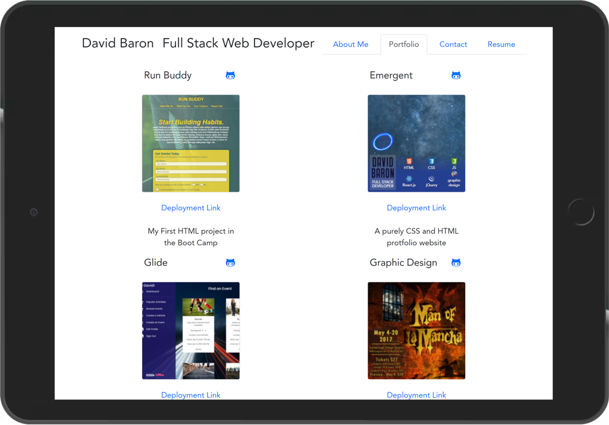

# dBaron - Online Portfolio
## An application by H0RSESH0E  
&nbsp;  
  
&nbsp;&nbsp;  
## Table of Contents
#### [Description](#description)  -  [Installation](#installation)  -  [Usage](#usage) - [License](#license) - [Contributing](#contributing) - [Tests](#tests) - [Questions](#questions)
&nbsp;  
## Description  
A straight-forward Portfolio built using React.  At present it is a barebones project that will provide a backbone to a more elaborate project when time permits.  
&nbsp;  
    
     
&nbsp;  
&nbsp; 
### [See the deployment here](https://h0rsesh0e.github.io/dBaron/)
## Installation
Use gh-pages to deploy the applications code.  
&nbsp;  
## Usage
This application plainly demonstrates the firm understanding I have of Web Development fundamentals.
&nbsp;  
## License  

**MIT License**  
A short and simple permissive license with conditions only requiring preservation of copyright and license notices. Licensed works, modifications, and larger works may be distributed under different terms and without source code.  
[View the full license here.](./LICENSE/license.txt)  
&nbsp;  
## Contributing
N/A  
&nbsp;  
## Tests
N/A  
&nbsp;  
## Questions
Questions or concerns about the project or how to contribute to its development can be emailed to: **dcpb777@gmail.com**  
&nbsp;  
&nbsp;  
  
  
**[Visit me on GitHub](https://github.com/H0RSESH0E)**  
